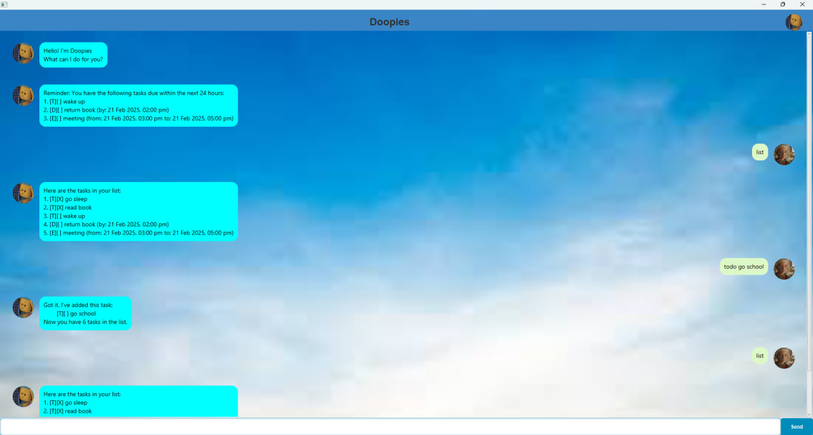

# Doopies User Guide

## Product Screenshot



## Introduction

Doopies is a smart task management bot that helps you keep track of **ToDos, Deadlines, and Events**. You can add, view, mark, delete, and find tasks easily. Your tasks are automatically saved and can be retrieved when you reopen the application.

## Adding Tasks

### 1. Adding a ToDo Task

To add a **ToDo task** (task without a due date):

Command: `todo {description}`

Example: `todo read book`

#### Expected Output:
```
Got it. I've added this task:
  [T][ ] read book
You now have 1 task(s) in your list.
```

---

### 2. Adding a Deadline Task

To add a **Deadline task** (task with a due date):

Command: `deadline {description} /by {DD/MM/YYYY HHmm}`

Example: `deadline return book /by 20/02/2025 2359`

#### Expected Output:
```
Got it. I've added this task:
  [D][ ] return book (by: 20 Feb 2025, 11:59 PM)
You now have 2 task(s) in your list.
```

---

### 3. Adding an Event Task

To add an **Event task** (task with a start and end time):

Command: `event {description} /from {DD/MM/YYYY HHmm} /to {DD/MM/YYYY HHmm}`

Example: `event project meeting /from 21/2/2025 1400 /to /21/2/2025 1600`

#### Expected Output:
```
Got it. I've added this task:
  [E][ ] project meeting (from: 21 Feb 2025, 2:00 PM to: 21 Feb 2025, 4:00 PM)
You now have 3 task(s) in your list.
```

## Viewing Tasks

### 1. View All Tasks

Command: `list`

Example: `list`

#### Expected Output:
```
Here are the tasks in your list:
1. [T][ ] read book
2. [D][ ] return book (by: 20 Feb 2025, 11:59 PM)
3. [E][ ] project meeting (from: 21 Feb 2025, 2:00 PM to: 21 Feb 2025, 4:00 PM)
```

---

### 2. View Reminders

Command: `reminders`

Example: `reminders`

#### Expected Output:
```
You have the following tasks due soon:
1. [T][ ] read book
2. [D][ ] return book (by: 20 Feb 2025, 11:59 PM)
3. [E][ ] project meeting (from: 21 Feb 2025, 2:00 PM to: 21 Feb 2025, 4:00 PM)
```

## Managing Tasks

### 1. Marking a Task as Done

Command: `mark {task number}`

Example: `mark 1`

#### Expected Output:
```
Nice! I've marked this task as done:
[T][X] read book
```

---

### 2. Unmarking a Task

Command: `unmark {task number}`

Example: `unmark 1`

#### Expected Output:
```
OK, I've marked this task as not done yet:
[T][ ] read book
```

---

### 3. Deleting a Task

Command: `delete {task number}`

Example: `delete 2`

#### Expected Output:
```
Noted. I've removed this task:
[D][ ] return book (by: 20 Feb 2025, 11:59 PM)
```

## Finding Tasks

### 1. Finding Tasks by Keyword

Command: `find {keyword}`

Example: `find book`

#### Expected Output:
```
Here are the matching tasks in your list:
1. [T][ ] read book
```

## Other Commands

### 1. Clearing All Stored Tasks

Command: `clear`

Example: `clear`

#### Expected Output:
```
All tasks have been deleted. Storage cleared!
```

---

### 2. Exiting Doopies

Command: `bye`

Example: `bye`

#### Expected Output:
```
Goodbye! Hope to see you again soon. 
```

---

### 3. Viewing All Commands

Command: `help`

Example: `help`

#### Expected Output:
```
Command List
___________________________________________________________________________________________________________

Notes:
1) Commands within {} are for user to fill up and {} can be ignored when typing in actual command.

2) When marking, unmarking or deleting tasks please call list to confirm the task number.

3) Current list will be stored in ../data/doopies.txt in chronological order
(todo tasks will be prioritise).
___________________________________________________________________________________________________________

Add Tasks:
1) todo task (no due date or no duration):
   command: todo {description}
   example: todo read book
            
2) deadline task (task with a due date):
    command: deadline /by {DD/MM/YYYY HHmm}
   example: return book /by 20/02/2025 2359

3) event task (task with a period to do it):
    command: event /from {DD/MM/YYYY HHmm} /to {DD/MM/YYYY HHmm}
    example: event project meeting /from 21/2/2025 1400 /to /21/2/2025 1600
___________________________________________________________________________________________________________

Viewing Tasks:
1) view all task in task list:
    command: list
            
2) view all undone todo task and deadline due within 24hrs or event starting within 24hrs:
    command: reminders
___________________________________________________________________________________________________________

Managing Tasks:
1) mark task as done:
    command: mark {task number on list}

2) unmark task as done:
    command: unmark {task number on list}

3) delete task:
    command: delete {task number on list}
___________________________________________________________________________________________________________

Miscellaneous:
1) clear storage saved in hard disk:
    command: clear

2) finding tasks using keyword(s) in task:
    command: find {keyword(s)}

3) shutdown the bot (app will close a second after this command):
    command: byes
___________________________________________________________________________________________________________
```

## Storage Information

- Your **task list is automatically saved** in:
  ```
  /data/doopies.txt
  ```
- Tasks are stored **chronologically**, and **ToDos are prioritized** over other tasks.

---

## Summary

- **Doopies helps you manage tasks efficiently**
- **Tasks are automatically saved and retrievable**
- **Simple command-based interaction**
- **Supports filtering, reminders, and storage management**

---

Now, you're ready to start using Doopies! 🚀🔥 Let us know if you need any refinements. 😊

